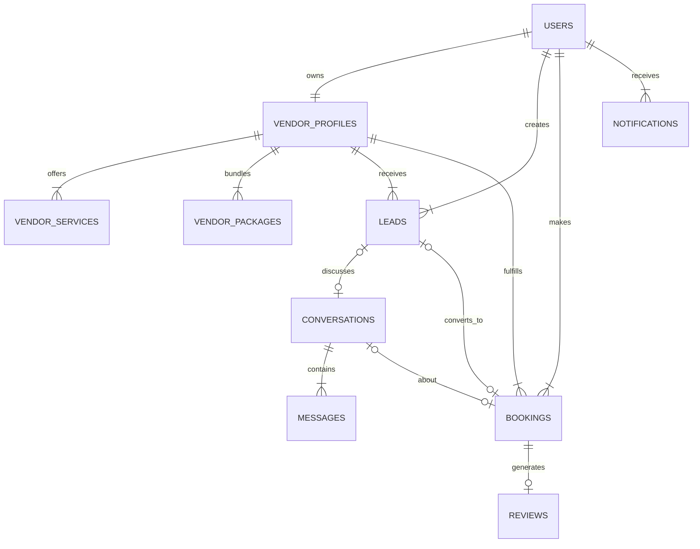

# Full Database Schema Architecture

This document outlines the **Complete Database Schema**, integrating the existing foundation with the new "Bridge" tables required for full system coordination.

## 1. conceptual Overview
The database is organized into 4 logical modules:
1.  **Identity**: Who are the users? (Clients, Vendors, Admins)
2.  **Catalog**: What do Vendors sell? (Services, Packages, Portfolio)
3.  **Operations**: How do they do business? (Leads, Chats, Bookings, Reviews)
4.  **System**: Support features (Notifications, Uploads, Logs)

---

## 2. Detailed Schema Definition

### Module A: Identity & Profiles (Existing)
*Foundational user management.*

*   **`users`**: Central identity.
    *   [id](file:///d:/project/eventbridge/eventbridgeapp/components/vendorlayout/sidebar.tsx#43-247), `email`, `password`, `accountType` (VENDOR/CLIENT), `firstName`, `lastName`.
*   **`vendor_profiles`**: Extended attributes for vendors.
    *   [id](file:///d:/project/eventbridge/eventbridgeapp/components/vendorlayout/sidebar.tsx#43-247), `userId` (FK), `businessName`, `serviceRadius`, `rating`.
*   **`accounts` / `sessions`**: Auth.js support tables for login sessions.

### Module B: Vendor Catalog (Existing)
*What the vendor offers to the public.*

*   **`vendor_services`**: Base offerings (e.g., "Photography").
    *   [id](file:///d:/project/eventbridge/eventbridgeapp/components/vendorlayout/sidebar.tsx#43-247), `vendorId`, `name`, `price`, `description`.
*   **`vendor_packages`**: Bundled offers (e.g., "Gold Wedding Package").
    *   [id](file:///d:/project/eventbridge/eventbridgeapp/components/vendorlayout/sidebar.tsx#43-247), `vendorId`, `name`, `features` (JSON), `price`.
*   **`vendor_portfolio`**: Showcasing past work.
    *   [id](file:///d:/project/eventbridge/eventbridgeapp/components/vendorlayout/sidebar.tsx#43-247), `vendorId`, `imageUrl`, `category`.
*   **`vendor_discounts`**: Promotional codes.
    *   [id](file:///d:/project/eventbridge/eventbridgeapp/components/vendorlayout/sidebar.tsx#43-247), `code`, `discountValue`, `validUntil`.

### Module C: Operations Flow (The Coordination Engine)
*Where the business actually happens. Mix of Existing & **New**.*

#### 1. Inquiries (**NEW**)
*   **`leads`**: Potential business. The start of the funnel.
    *   [id](file:///d:/project/eventbridge/eventbridgeapp/components/vendorlayout/sidebar.tsx#43-247), `vendorId` (FK), `clientId` (FK).
    *   `eventName`, `eventDate`, `budget`, `guestCount`.
    *   `status`: 'new' | 'contacted' | 'qualified' | 'booked' | 'lost'.

#### 2. Communication (**NEW**)
*   **`conversations`**: The link between two people.
    *   [id](file:///d:/project/eventbridge/eventbridgeapp/components/vendorlayout/sidebar.tsx#43-247), `vendorId` (FK), `clientId` (FK).
    *   `bookingId` (FK - Optional, if chatting about a specific job).
    *   `leadId` (FK - Optional, if chatting about a specific lead).
    *   `lastMessageAt`: For sorting inbox.
*   **`messages`**: The content history.
    *   [id](file:///d:/project/eventbridge/eventbridgeapp/components/vendorlayout/sidebar.tsx#43-247), `conversationId` (FK), `senderId` (FK).
    *   `content`: Text body.
    *   `attachmentUrl`: For files/images.
    *   `isRead`: Boolean.

#### 3. Contracts (Existing)
*   **`bookings`**: The finalized agreement.
    *   [id](file:///d:/project/eventbridge/eventbridgeapp/components/vendorlayout/sidebar.tsx#43-247), `vendorId` (FK), `clientId` (FK), `eventId`.
    *   `packageId` (FK), `serviceId` (FK).
    *   `status`: 'pending' | 'confirmed' | 'completed' | 'cancelled'.
    *   `totalAmount`: Final agreed price.

#### 4. Reputation (Existing)
*   **`reviews`**: Post-completion feedback.
    *   [id](file:///d:/project/eventbridge/eventbridgeapp/components/vendorlayout/sidebar.tsx#43-247), `bookingId` (FK), `rating` (1-5), `comment`.

### Module D: System Utilities
*   **`notifications` (**NEW**)**: Persistent alerts.
    *   [id](file:///d:/project/eventbridge/eventbridgeapp/components/vendorlayout/sidebar.tsx#43-247), `userId` (FK).
    *   `type`: 'booking_request', 'new_message', 'payment_received'.
    *   `content`: Display text.
*   **`user_uploads` (Existing)**: File management.
*   **`events` (Existing)**: Client-side event planning container.

---

## 3. Relationships & Coordination Map

## 4. Implementation Strategy
We will implement the **New** tables (`leads`, `conversations`, `messages`, `notifications`) into [drizzle/schema.ts](file:///d:/project/eventbridge/eventbridgeapp/drizzle/schema.ts) alongside the existing ones. This creates a fully connected graph where a user can flow from **Lead -> Chat -> Booking -> Review**.
